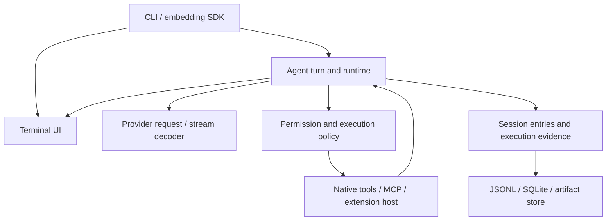

# Architecture and navigation

Davinci is a Rust coding-agent workspace. The CLI assembles the execution
engine, provider clients, terminal UI, session stores, and extension hosts.
JavaScript remains in the extension bridge, exported-session viewer, fixtures,
and the preserved TypeScript reference.

## Start here

| Work | Entry point |
| --- | --- |
| CLI flags, startup, commands | [coding-agent/src/main.rs](../crates/davinci-coding-agent/src/main.rs), `args.rs`, `startup.rs` |
| Interactive display/input | [coding-agent/src/davinci_interactive.rs](../crates/davinci-coding-agent/src/davinci_interactive.rs), [tui/src/lib.rs](../crates/davinci-tui/src/lib.rs) |
| Embedding | [coding-agent/src/sdk.rs](../crates/davinci-coding-agent/src/sdk.rs), exported by `src/lib.rs` |
| Model turns and tool execution | [agent/src/lib.rs](../crates/davinci-agent/src/lib.rs), `turn.rs`, `tools.rs`, `permission.rs` |
| Provider requests/streaming | [ai/src/stream.rs](../crates/davinci-ai/src/stream.rs), `request_shape.rs`, `stream_decoder*.rs`, `codex*.rs` |
| Native capabilities | [coding-agent/src/native_extensions/](../crates/davinci-coding-agent/src/native_extensions/), [agent/src/runtime/](../crates/davinci-agent/src/runtime/) |
| Voice subprocess | [voice/src/bin/davinci-voice-worker.rs](../crates/davinci-voice/src/bin/davinci-voice-worker.rs) |

Read the relevant manifest and module declarations first. The CLI and embedding
library compile some of the same source modules; check both targets when
changing those modules.

## Responsibilities

The root [Cargo.toml](../Cargo.toml) declares 14 active crates. Their dependencies
form a directed graph with shared contracts and supporting libraries.

| Crate | Owns |
| --- | --- |
| `davinci-coding-agent` | `davinci` executable; startup, settings/trust, sessions, CLI RPC, JS/native extension assembly |
| `davinci-agent` | Agent turns, tool dispatch, permissions, scheduler, planning/subagents, cache/context/evidence runtime |
| `davinci-ai` | Models, authentication/OAuth, request shaping, SSE/WebSocket decoding, retries and usage |
| `davinci-mcp` | MCP configuration, JSON-RPC, stdio and HTTP transports |
| `davinci-tui` | Terminal rendering, editor/widgets, themes, command sheets and voice UI state |
| `davinci-voice` | Audio/state contracts, capture, speech engine bindings and isolated worker |
| `davinci-session` | Session/repository contracts, JSONL codec/discovery, branches and context history |
| `davinci-session-sqlite` | SQLite repositories, migrations, fact/log persistence and branch caches |
| `davinci-protocol` | Typed IPC schemas, CBOR codec and length-prefixed framing |
| `davinci-client` | Framed and in-process transports, handshake and client state |
| `davinci-server` | Session controller/dispatcher and Unix transport for the typed client/server API |
| `davinci-telemetry` | Telemetry contracts and local aggregate run reports |
| `davinci-evals` | Evaluation harnesses, engineering scenarios and benchmark artifacts |

## Main flows



1. Startup resolves settings, project trust, resources, credentials and a model.
   The CLI or SDK constructs the agent and session adapters.
2. A turn compiles context and calls a provider. Decoded events update the
   transcript; tool calls pass through policy and dispatch before their results
   enter the next turn. Application approval is not an operating-system sandbox
   for approved commands.
3. Session entries carry parent IDs and sequence numbers. JSONL preserves event
   history; SQLite also maintains derived facts and branch caches. Related
   SQLite writes commit or roll back together.
4. Context VM pages and caches are derived state. Active mode compiles one
   immutable provider image per revision within a shared input/output budget.
   After attempted recovery, any image-preparation error blocks provider
   dispatch, including mandatory overflow and unavailable page storage.
   Historical tool evidence is data context; only a complete current tool
   exchange retains protocol IDs. Estimates are conservative byte ceilings,
   not exact provider token counts. See [Context VM](context-vm.md).
5. Native engineering tools share an immutable repository/metadata snapshot.
   Mutations and new turns invalidate it; cache hits recheck authorization and
   observed changes. Jev reads available facts in a bounded background job.
   Unobserved Git and capability facts remain unknown.
6. Execution receipts reference immutable, content-addressed artifacts.
   Publication is atomic and no-clobber; retrieval verifies size and SHA-256.

The typed client/server API uses protocol envelopes and a versioned Hello
handshake. The CLI's `rpc.rs` interface and MCP are separate surfaces; changing
one does not automatically change the others.

## External boundaries and limits

- Provider HTTP/SSE/WebSocket endpoints and OAuth callbacks belong to
  `davinci-ai`; CLI startup controls discovery and credential selection.
- MCP starts configured local commands or contacts HTTP servers. The JS bridge
  starts a Node host. Native capabilities may launch language servers, browsers,
  build tools, or managed processes.
- Git/npm installation belongs to `coding-agent/src/packages.rs`. Git checkout
  paths must stay under the package root before replacement or copy.
- Recursive grep excludes credential-classified descendants even when a glob
  names them. Explicit credential paths still pass through caller permissions.
- Provider SSE read-ahead is bounded to eight lines and each raw frame to
  16 MiB. The non-SSE fallback body is also limited to 16 MiB. Final responses
  and returned event histories still grow with the accepted response.
- Local behavioral telemetry retains the latest 4,096 settled runs, in order.
  It is an in-memory report source, not a durable or lifetime audit log.

## Configuration and layout

User configuration normally lives in `~/.pi/agent/`: `settings.json`,
`auth.json`, `models.json`, `mcp.json`, keybindings and resources.
`PI_CODING_AGENT_DIR` relocates it; `PI_CODING_AGENT_SESSION_DIR` relocates
sessions. Project configuration/resources live in `<project>/.pi/` and are
subject to project trust. Keep real credentials and private sessions out of
fixtures and source control.

- `scripts/`: installation, platform checks and development helpers.
- `docs/`: current capability guides, specifications and historical plans.
  Plans describe intent; code and fresh verification establish current behavior.
- `vendor/davinci/`: pinned TypeScript behavioral reference; preserve it during
  Rust feature work.
- `crates/davinci-coding-agent/export-html/`: standalone session HTML template,
  browser assets and viewer tests, included by the exporter.

## Validation

Rust 1.83 is the baseline. Keep exact dependency pins and the lockfile consistent.
Unit tests are usually inline; larger scenarios and deterministic evals live in
each crate's `tests/` directory. Fixtures may use loopback servers, subprocesses
or platform APIs. Live provider, browser, voice and benchmark runs are separate.

Run affected crate tests and integration selectors. Workspace static checks and
the exported viewer gate are:

```sh
cargo check --workspace --all-targets --offline --locked
cargo fmt --all --check
cargo clippy --workspace --all-targets --offline --locked -- -D warnings
node --test crates/davinci-coding-agent/export-html/template.test.cjs
```

Offline Cargo commands require cached dependencies. See the
[audit record](security/repository-audit-2026-09-19.md) for measured results,
platform coverage and residual risks.
