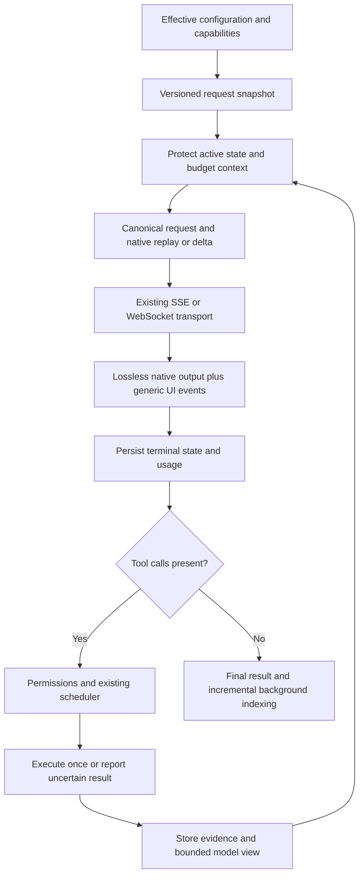

# OpenAI Harness Efficiency Implementation Plan

> **Execution:** Use Superpowers `executing-plans` inline, one writer, task by task. Do not use subagents. This document is a planning deliverable, not authorization to implement, run tests, start provider jobs, install dependencies, commit, or change routing. The user's no-tests constraint remains in force until explicitly lifted. All validation commands and test cases below are future acceptance work, not results from this planning session.

**Goal:** Reduce the tokens, provider round trips, and time required to complete verified tasks with OpenAI models while preserving Davinci's correctness, permissions, session compatibility, and provider-neutral architecture.

**Architecture:** Finish the integration of the existing OpenAI/Codex components into the real Rust request path. Retain generic transcripts for UI and cross-provider use, preserve native Responses state beside them, and select request features by verified backend/model capabilities. Make tool schemas and evidence smaller before they enter context; measure cost and latency at the actual request and execution boundaries.

**Tech stack:** Rust 1.83.0, existing exactly pinned workspace dependencies, serde/serde_json, current SSE/WebSocket clients, JSONL sessions, native MCP, existing Token Governor and evidence stores. RTK and Headroom remain optional external integrations; the implementation remains Rust.

**Design inputs:** [Codex efficiency design](../specs/2026-09-03-codex-efficiency-design.md), [harness reliability design](../specs/2026-09-04-harness-reliability-design.md), [ecosystem design](../specs/2026-09-04-davinci-ecosystem-integration-design.md), and the requirements and decisions in this document. The older file named `2026-09-03-codex-efficiency-design.md` under `plans/` is also a design narrative. This plan supplies current implementation sequencing; it does not claim that the historical design has already shipped.

**Evidence baseline:** Source inspected on 2026-09-04 at Git HEAD `2919e9c80627798ca2b9451021edc6f8ac1c4e1c`. No builds, tests, benchmark runs, or provider completions were executed. Current production routing, credentials, account capabilities, and achievable savings were not verified. Other work appeared during planning in `davinci_interactive.rs`, `slash.rs`, and session `discovery.rs`; preserve it and rebase file-level assumptions before implementation. The pre-existing untracked `plugins/` directory is out of scope.

## 1. Global constraints and completion definitions

- Read root and applicable directory `AGENTS.md` before implementation. `docs/CODEX-NAVIGATION-GUIDE.md` was not present when checked; do not assume the generic ECC project layout exists here.
- `crates/*` is the implementation. `vendor/davinci` at pinned upstream commit `853a80d26c90a14c1886f0ebb8ffaae133ca2185` is read-only reference; `packages/*` is not the reference.
- Preserve CLI flags, TUI, print/JSON/RPC modes, SDK behavior, provider credentials, and `.davinci`/legacy `.pi` sessions and settings.
- Preserve verbatim upstream system, compaction, and branch prompt constants. Optimize their placement and repeated injection, not their wording.
- Keep Rust 1.83.0 and exact dependency pins. Start without new dependencies. A tokenizer, compressor, or transport dependency needs a separate necessity/MSRV/license assessment and authorization where applicable.
- Preserve read-lane concurrency and mutation barriers, deny-wins permissions, tool aliases, extension guards, graph Writer restrictions, and explicit patch-journal recovery.
- Never claim universal exactly-once external effects. Persisted execution records can prevent known duplicate dispatch; a crash after an external effect but before result persistence requires an explicit uncertain state.
- Do not log prompts, credentials, headers, raw tool arguments/results, encrypted reasoning, personal paths, or credential-derived identifiers in efficiency telemetry.
- Keep immutable protocol snapshots and projections; use existing Rust ownership conventions for runtime state. Do not impose a broad immutability refactor.
- All future automated tests must be offline and fixture-driven, with inline Rust test modules. Fixtures may live under `crates/davinci-parity/fixtures`. Do not create external `tests/` directories.
- No subagent calls are required to execute or evaluate this plan. Existing graph behavior is a compatibility boundary, not a proposed new orchestration layer.
- A future commit, push, external benchmark, paid request, or settings/routing change requires the authorization applicable to that action. Do not insert automatic commit steps into these tasks.

Three different milestones must remain separate:

1. **Planning complete:** the plan has source evidence, implementation contracts, dependencies, failure handling, acceptance cases, rollback, and coverage mapping.
2. **Implementation integrated:** the production call path consumes the feature and its effective flag; offline acceptance is green when testing becomes authorized.
3. **Efficiency demonstrated:** paired measurements meet correctness and performance gates. Static inspection and synthetic token totals cannot prove this milestone.

## 2. Current state and prioritized gaps

The following are source findings, not measured failures or a whole-repository security audit. Line numbers are navigation anchors at the baseline; symbols are authoritative after edits.

| Area | Evidence | Consequence and planned response |
|---|---|---|
| Active provider call | `crates/davinci-coding-agent/src/main.rs:1750` builds provider messages and calls `live_complete_streaming_with_sink`; `crates/davinci-ai/src/stream.rs` selects Codex WS or HTTP | Integrate at these boundaries and cover other callers, including SDK/RPC; do not add another disconnected framework. |
| Capability/flag/hash/telemetry components | `codex_capabilities.rs`, `codex_flags.rs`, `request_shape.rs`, and `codex_telemetry.rs` exist. Workspace symbol searches found definitions, exports, and local tests, but no production consumers of their principal entry points | Treat them as integration work. A module or flag declaration is not proof of active behavior. Tasks 1–3. |
| Responses fidelity | `ResponsesDecoder::raw_items` records completed items at `stream_decoder.rs:837`; `StreamDecoder` exposes only generic finish/events. `AssistantMessage` has no native-output field | Carry native outputs through decoding, completion, persistence, and replay. Task 4. |
| Reconstructed history | `openai_responses_input` rebuilds assistant text/function calls; `codex_ws.rs:215` rebuilds cached outputs through `assistant_to_chat` | Reasoning, phases, custom-tool identity, unknown fields, and multimodal state need an explicit lossless path. Do not mistake a working normalized continuation for full protocol fidelity. Tasks 4–5. |
| Upstream reference | `vendor/davinci/packages/ai/src/api/openai-responses-shared.ts:222` replays thinking signatures; `:245` preserves phase; `:533` handles terminal encrypted-content backfill | Use these behaviors as fixtures and preserve the full raw JSON object, including future fields. |
| Existing ledger | `ResponsesItem::from_json_value` converts recognized types to narrow structs, with `Raw` fallback | A known item with additional fields can deserialize successfully and lose fields on reserialization. Raw JSON must remain authoritative even for known types. Task 4. |
| Existing transport | `codex.rs` and `codex_ws.rs` implement live continuation, socket reuse, missing-response replay, and pre-output fallback. `codex_transport.rs` is a separate state/payload abstraction | Extend the working socket owner; do not install a second competing connection cache. Task 5. |
| Cache request fields | `stream.rs:938–1050` already sorts tools and sends cache keys. Long retention uses `prompt_cache_retention: "24h"` under a compatibility bit | Keep working behavior. Add model/backend-specific cache dialect selection, rather than applying current public API fields to every route. Task 3. |
| Tools | `ToolSpec` is function-shaped; Responses serialization emits functions. `builtin_and_mcp_specs` adds active MCP schemas; `tool_search_tool` returns matching names only | Complete actual discovery → activation → next-request schema delivery, and provider-native custom tools where supported. Task 6. |
| Context | `Agent::estimated_context_tokens` now includes system/schema overhead; `main.rs:1662` caches host overhead. Estimation still uses byte/character heuristics | Preserve this reliability fix; account for the final request shape, output reservation, dynamic schema changes, and estimation error. Task 8. |
| Pruning | `pruning.rs` defaults to start 0.50, target 0.35, keep 8 recent results; placeholder tells the model to rerun the tool | Prefer exact evidence retrieval over repeating commands. Pruning must invalidate continuation and protect active evidence. Tasks 7–8. |
| Compaction | Reliability design identifies compaction summarizing raw history, including already pruned output | Summarize the provider projection without losing durable entry IDs, pending calls, or resume state. Task 9. |
| Output governance | Token Governor has 8,192-byte/200-line compression thresholds, exact-tool exemptions, storage, and paged `retrieve_output` | Reuse it. Add accountable compression selection and retrieval economics; do not stack lossy transformations blindly. Task 7. |
| Retries | Agent retries are interruptible; provider HTTP retries and Codex recovery also exist | Trace actual nested attempts; coordinate one allowance without multiplying retry loops. Task 5. |
| Measurement | Usage decoders and `RunStats` already count useful data. `codex_eval.rs` accepts caller-populated measurements; rich telemetry writer lacks production callers | Capture real events and evidence-backed verifier outcomes before using the release gate. Tasks 2 and 12. |
| Background work | Reliability design identifies full-history memory scanning before dedupe | Incremental indexing and accounting for learning/retrieval overhead. Task 11. |

## 3. Chosen approach and alternatives

**Recommended: complete the native integration in measured slices.** Begin with effective configuration and telemetry, preserve native state, then optimize schemas, evidence, and context. This addresses repeated work without replacing the Rust harness.

| Approach | Benefit | Tradeoff | Decision |
|---|---|---|---|
| Integration-first native Rust profile | Reuses working provider, scheduler, governor, session, and permission code | Requires careful seam and migration work | Implement this plan. |
| Make Headroom rewrite all requests | Potential centralized compression | Cache-prefix changes, opaque-item handling, routing, and storage semantics need separate proof | Preserve existing routes; no blanket proxy rewrite. Use targeted compression first. |
| Rewrite around another agent runtime, add a router, or delegate more work | Could offer additional orchestration | Larger scope, new context duplication, more inference, more compatibility risk | Excluded. No subagents or new outer loop. |

Efficiency is evaluated per verified task, not per shortest prompt. Smaller input can increase retries, missing-evidence retrieval, or reasoning. Delta requests reduce transmitted payload; they do not by themselves prove reduced billed context. Cache-read, cache-write, output, reasoning, compression, and recovery costs must all be attributable.

### Current OpenAI documentation boundary

- Public OpenAI documentation distinguishes cache settings by model generation: current guidance uses `prompt_cache_options.ttl` for newer models and retention fields for earlier ones. Support must be selected per backend/model; cache keys alone do not establish reuse. [Prompt caching](https://developers.openai.com/api/docs/guides/prompt-caching)
- WebSocket continuation can recover from a missing prior response by starting with complete applicable context. State available after reconnect depends on storage and backend behavior. Preserve configured retention rather than enabling storage to make continuation work. [WebSocket mode](https://developers.openai.com/api/docs/guides/websocket-mode)
- Standalone compaction returns a canonical next window, potentially including retained items as well as an opaque item. Do not prune that returned window. Server-managed chaining must not be combined with independent manual pruning. [Compaction](https://developers.openai.com/api/docs/guides/compaction)
- Current model guidance describes capability-limited `configuration_update` effort changes. Keep model/effort stable initially; do not assume this mechanism works on Codex OAuth, Azure, or a proxy. No model migration is required by this plan. [Model guidance](https://developers.openai.com/api/docs/guides/latest-model)

These pages were read during planning. They establish public API documentation, not account access or private Codex backend conformance. Refresh narrow relevant documentation when implementation starts.

## 4. Request lifecycle and dependency order



Use this implementation order with one writer: **1 → 2 → 3 → 4 → 5 → 6 → 7 → 8 → 9 → 10 → 11 → 12 → 13**. Dependencies are narrower than that execution order: schema work (6) and output work (7) can be designed independently after 1–2; cache serialization (3) does not depend on the native ledger (4); incremental indexing (11) does not depend on WebSocket changes (5). Independent file/document reads can run together. This does not authorize parallel agents or concurrent writers.

| Task | Required predecessors | Priority | Deliverable |
|---|---|---|---|
| 1 | None | P0 | Effective capability/configuration snapshot and integration map |
| 2 | 1 | P0 | Attributable runtime telemetry |
| 3 | 1, 2 | P1 | Deterministic, capability-correct cache requests |
| 4 | 1, 2 | P0 | Lossless native output, persistence, and replay |
| 5 | 3, 4 | P0 | Safe continuation, isolation, cancellation, recovery |
| 6 | 1, 2, 3; 4 for native tools | P1 | Small tool surface with real deferred activation |
| 7 | 1, 2 | P1 | Reversible output compression and retrieval |
| 8 | 3, 4, 6, 7 | P1 | Final-request budget and protected context |
| 9 | 4, 5, 8 | P1 | Projection-aware compaction and resume |
| 10 | 1, 2, 3, 8 | P2 | Explicit model/effort/output policy |
| 11 | 2; 9 for compaction reset | P2 | Incremental background processing |
| 12 | 2; all enabled candidates | P0 gate | Actual end-to-end evaluator and ablations |
| 13 | 12 | Release gate | Configuration, migration, rollback, and evidence packet |

## 5. Detailed implementation tasks

The contracts below are proposed additions unless explicitly called existing. Code blocks specify wire shapes or algorithms; they are not claimed to be compiled patches. Each checkbox is an implementation action. Split a task at its named acceptance boundary if it no longer fits a focused review. Start each task by rechecking its files, callers, and current instructions.

### Task 1: Connect effective configuration and capabilities

**Files:** Modify `crates/davinci-ai/src/codex_capabilities.rs`, `codex_flags.rs`, `stream.rs`, `lib.rs`; `crates/davinci-coding-agent/src/settings.rs`, `main.rs`, `sdk.rs`. Add an inline `openai_efficiency` settings module only if needed to avoid enlarging a shared parser; do not restructure unrelated settings.

**Inputs:** Resolved model, actual selected endpoint, credential kind/account identity from trusted auth resolution, user options, existing `compat` metadata. **Output:** An immutable effective profile per request lineage, passed to the provider request builder; a sanitized view is available to diagnostics.

- [ ] Inventory every caller of `request_body_with`, `live_complete_streaming_with_sink`, `complete_simple`, and `CodexFeatureFlags`; distinguish CLI, RPC, SDK, fixtures, and extension-owned providers.
- [ ] Define one effective-profile resolver. Precedence: explicit CLI/session choice → trusted project setting → user setting → existing defaults. Preserve legacy `PI_*` names; any `DAVINCI_*` aliases must have documented precedence. Invalid enum/number values return a configuration error, not silent feature enablement.
- [ ] Separate `PublicOpenAI`, `CodexOAuth`, `AzureResponses`, and `CompatibleEndpoint` backend families. Parse URL host/origin using existing URL support; `url.contains("chatgpt.com")` and `is_oauth` alone must not grant all Codex capabilities.
- [ ] Distinguish configured support, documentation support, and observed support in diagnostics. Unknown grammar tools, namespaces, cache breakpoints, prewarm, multiplexing, and server compaction default off. Do not probe by sending an inference request.
- [ ] Wire supported existing flags to real branches. Add missing granular switches only for features this plan implements. Reject dependent feature combinations or resolve them conservatively with a visible reason.
- [ ] Retain independent safety controls: disabling optimization cannot disable permission checks, patch journal protection, or duplicate-effect safeguards. Deprecate any misleading interpretation of `all_disabled()` as permission to disable safety.

Proposed effective-profile diagnostic shape, with no endpoint secrets:

```json
{
  "schemaVersion": 1,
  "backendFamily": "compatible_endpoint",
  "model": "configured-model-id",
  "source": "trusted_configuration",
  "features": {"nativeReplay": false, "deferredTools": false, "compression": "native"},
  "unsupported": ["serverCompaction", "prewarm"],
  "profileRevision": 1
}
```

**Acceptance cases:** All four backend families; hostile lookalike hostname; unknown model; API-key proxy versus OAuth; disabled flag changes the actual request; incompatible flags; old configuration loads; offline configuration causes no discovery traffic. Non-OpenAI request snapshots remain unchanged.

**Handoff:** Effective profile contract, supported switches, caller inventory, and explicit unsupported routes. **Rollback:** Existing request behavior remains selectable; runtime safety remains enabled.

### Task 2: Measure the real request and tool path

**Files:** Modify `crates/davinci-ai/src/codex_telemetry.rs`, `stream.rs`, `stream_decoder.rs`, `stream_decoder_completions.rs`, `codex_ws.rs`; `crates/davinci-agent/src/stats.rs`, `turn.rs`; `crates/davinci-coding-agent/src/main.rs`, `extension_host.rs`; `crates/davinci-evals/src/codex_eval.rs` for metric schema only.

**Inputs:** Effective profile, monotonic clock observations, actual request body metadata, terminal provider usage, executed tool outcomes. **Outputs:** Versioned sanitized events and per-run totals consumed by Task 12.

- [ ] Put event hooks immediately around request construction, actual send attempts, first provider event, first text/tool-ready event, terminal decode, tool queue/start/end, compression/retrieval, and compaction. Count provider retries when an additional request starts, not when a backoff is scheduled.
- [ ] Extend existing event types with optional fields and `serde(default)` compatibility. Use monotonic durations; reserve wall-clock timestamps for correlation. Make missing data `null`/unknown, not zero cost.
- [ ] Record actual model/backend/profile revision, schema count/bytes, request bytes, transmitted item count, replay reason, continuation count, cached/uncached/cache-write/output/reasoning tokens, recovery attempts, compression time, and evidence retrieval time. Add request and session sequence IDs generated independently of credentials.
- [ ] Keep network bytes, context estimates, provider token usage, and money in separate units. Trace `Usage` in `davinci-protocol` and the actual decoder imports before editing similarly named types in `davinci-ai`; do not change a dead duplicate type.
- [ ] Define normalization once per provider dialect. Do not subtract cached tokens twice from a normalized `Usage.input`. Do not add reasoning tokens a second time when they are included in output tokens. Cache-write pricing treatment is model-specific; use a dated pricing source or report cost unknown.
- [ ] Emit typed, allowlisted fields only. The current broad sanitizer matches keys containing `token`; do not run that over numeric usage and erase measurements. Do not use arbitrary user text for `replay_reason` or labels.
- [ ] Use bounded buffering and explicit dropped-event/write-error counters. Telemetry I/O must not block model streaming indefinitely or fail the user's task. Missing events make a benchmark incomplete, not successful.
- [ ] Use the existing `.davinci`/legacy path resolver and telemetry consent conventions. Do not hardwire a new global `.pi` log location or enable network reporting.

Accounting invariant:

```text
logical_model_responses = completed_or_failed_logical_response_operations
provider_attempts = count(actual inference sends, including recoveries)
provider_retries = max(provider_attempts - initial_sends, 0)
normalized_input = uncached_input + cache_read + separately_partitioned_cache_write
reasoning_output <= total_output, when the backend defines reasoning as a subset
task_cost = model_cost + compaction_cost + compression_cost + other billed calls
```

`separately_partitioned_cache_write` is included only for a decoder that has removed those tokens from the other input partitions. Keep raw provider counters available as numeric diagnostic fields to check normalization.

**Acceptance cases:** Cached and uncached usage, no usage after disconnect, duplicate terminal frame, cancelled backoff, two real retry attempts, parallel tools counted once in wall time, unknown price, old stats JSON, denied telemetry write, raw-secret sentinel excluded from emitted event fields.

**Handoff:** Event schema, field/unit definitions, sample synthetic rows explicitly labeled synthetic, and coverage of CLI/SDK/RPC entry points. **Rollback:** Disable event output; preserve existing RunStats behavior.

### Task 3: Stabilize requests and select the right cache dialect

**Files:** Modify `crates/davinci-ai/src/cache.rs`, `request_shape.rs`, `stream.rs`, `codex_capabilities.rs`; `crates/davinci-coding-agent/src/main.rs`; `crates/davinci-agent/src/context.rs` only for instruction-source identity; preserve existing ecosystem cache-affinity functions.

**Reference:** `vendor/davinci/packages/ai/src/api/openai-prompt-cache.ts`, `openai-responses.ts`, `openai-codex-responses.ts`, and `openai-responses-shared.ts`.

**Inputs:** Effective profile, ordered applicable instructions, exact advertised schemas, permissions revision, conversation/cache identity. **Outputs:** Canonical serialized request, stable-prefix digest, shape digest, and cache-dialect selection.

- [ ] Preserve current deterministic function ordering. Canonicalize JSON objects recursively where object order is not semantic; preserve array order, message order, and instruction precedence. Sort set-valued feature flags before hashing. Hash the actual emitted tool structure, including namespace/custom definitions.
- [ ] Construct stable base/repository instructions once per source revision. Track canonical path plus content digest so the same instruction file is not injected twice accidentally. Different files with conflicting instructions must remain ordered and intact; do not summarize or deduplicate them by approximate similarity.
- [ ] Keep ephemeral memory, changing status, timestamps, and active-turn facts out of the stable instruction prefix where existing role semantics permit. Never move a safety instruction to a weaker role just to improve caching.
- [ ] Define explicit cache dialects: legacy retention, current options, backend-specific supported fields, and unsupported. The chosen dialect controls which fields are emitted; never send both retention dialects speculatively.
- [ ] Preserve cache `off` semantics for each supported dialect. Explain that removing client cache fields is not a guarantee that a backend disables all internal caching. Keep explicit-breakpoint features gated and start with one verified boundary.
- [ ] Keep three identities separate: prompt-cache affinity, session/branch continuation, and request-shape revision. Do not use `PI_GRAPH_CACHE_KEY` as a socket or session ownership key. Bound/normalize cache key length using the existing helper.
- [ ] Recompute the profile/shape when model, instructions, permissions, schemas, reasoning configuration, endpoint family, or compaction generation changes. Normal message append does not change the stable-prefix digest.

Dialect example, emitted only when that backend/model supports it:

```json
{"prompt_cache_key":"opaque-conversation-key","prompt_cache_options":{"mode":"implicit","ttl":"30m"}}
```

**Acceptance cases:** Repeat request gives identical prefix; tool insertion order does not matter; changed schema does matter; changed instruction file takes effect; ephemeral retrieval preserves base prefix; long/Unicode key; cache off; older retention; unknown proxy gets no new fields; account/branch isolation stays separate from cache affinity.

**Handoff:** Golden request variants and invalidation table. **Rollback:** Select legacy dialect/profile; start a fresh continuation lineage when shape changes.

### Task 4: Carry lossless Responses state through the complete lifecycle

**Files:** Modify `crates/davinci-ai/src/responses_ledger.rs`, `stream_decoder.rs`, `stream.rs`, `lib.rs`, `codex_ws.rs`; `crates/davinci-agent/src/turn.rs`, `lib.rs`; session serialization/loading in `crates/davinci-session/src/types.rs`, `jsonl_repo.rs` only where needed. Search actual `Agent` session storage callers before choosing the append API: similarly named repositories are not interchangeable.

**Inputs:** Raw streamed or terminal Responses output and current lineage. **Outputs:** Versioned native state in completion and durable session records; generic UI messages remain supported.

- [ ] Store the original JSON object for every item, including recognized items. Typed accessors are views; they never reconstruct the authoritative object. Preserve unknown fields, image/file parts, reasoning items, phases, custom tool input, call IDs, refusals, and compaction items.
- [ ] Reconcile `output_item.done` and terminal `response.output` by output index and item ID. Terminal data may backfill encrypted reasoning; do not append duplicates or reorder items. Inconsistent duplicate identity is a protocol error, not silently merged state.
- [ ] Add optional native-output data to `AssistantMessage`, defaulting absent for old payloads. Export it through the trait-object decoder path and through both streaming and non-streaming completion. Avoid copying large native arrays into every token delta; attach finalized data at completion, with bounded partial recovery state.
- [ ] Preserve generic compatibility using versioned metadata in `ChatMessage.extra`, and explicitly include it in `persist_assistant`, which currently constructs a fresh message object. Keep metadata out of rendered text and non-OpenAI request conversion.
- [ ] Persist session version, backend/profile identity, capability revision, model/effort, schema revision, lineage, response ID, native items, and terminal status. Commit response boundaries only after terminal validation. An interrupted record cannot advertise a resumable completed response.
- [ ] Reopen old sessions through generic replay with a fresh lineage. New sessions reload losslessly. Forks inherit applicable evidence but get distinct continuation ownership. A model/provider/account change cannot reuse foreign encrypted state; retain it locally and use the compatible projection.
- [ ] Add native replay to the existing request builder. Use normalized generic replay only for legacy/no-native segments, without duplicating items already represented by native state. Preserve call/output pairing in mixed old/new histories.
- [ ] On persistence failure, surface durability uncertainty and disable unsafe resume/continuation claims. Do not advance durable checkpoints optimistically.

Proposed metadata envelope:

```json
{
  "davinciResponsesV1": {
    "lineageId": "generated-lineage-id",
    "profileRevision": 1,
    "responseId": "resp_fixture_1",
    "status": "completed",
    "items": [{"type":"reasoning","id":"rs_fixture_1","encrypted_content":"fixture-only","future_field":{"x":1}}]
  }
}
```

**Concrete future regression:** In `responses_ledger.rs`'s inline tests, round-trip a recognized item containing an unknown field:

```rust
let item = serde_json::json!({
    "type": "function_call", "id": "fc_1", "call_id": "call_1",
    "name": "read", "arguments": "{}", "future_field": {"revision": 2}
});
assert_eq!(ResponsesItem::from_json_value(&item).to_json_value(), item);
```

**Additional acceptance:** Arbitrary stream fragmentation; terminal-only output; encrypted backfill; custom call/output; image user/result; commentary/final phase; incomplete and failed terminal; truncated JSONL tail; fork; legacy resume; switch to another provider; raw opaque data never enters telemetry. These must exercise the completion-to-session-to-request path, not just the enum helper.

**Handoff:** Persisted schema, migration behavior, raw replay fixtures. **Rollback:** Retain native metadata on disk; generic readers ignore it and start a fresh lineage. Never delete the user's session.

### Task 5: Consolidate continuation, transport isolation, and recovery

**Files:** Modify `crates/davinci-ai/src/codex.rs`, `codex_ws.rs`, `codex_transport.rs`, `stream.rs`, `provider_retry.rs`, `auth.rs`; `crates/davinci-agent/src/turn.rs`, `tool_ledger.rs`. Preserve `scheduler.rs`'s existing ordering.

**Inputs:** Canonical request, lossless ledger, actual endpoint, account/session/branch identity, cancellation, tool execution records. **Outputs:** One live socket owner and an explicit bounded recovery state machine.

- [ ] Keep `codex_ws.rs` as the live socket owner. Either make `codex_transport.rs` its policy component or remove redundant state after integration; do not maintain two definitions of response IDs, socket age, or retries.
- [ ] Key live connections by actual endpoint origin/path plus authenticated account and session/branch lane. Audit existing `LiveSocketKey`, which currently carries session/account. Identity changes invalidate continuation; credential values are neither cache keys nor logs.
- [ ] Build delta input only from the last completed matching lineage and exact native prefix. Keep instructions and required request options present on continuation. An edited/pruned prefix, schema change, branch switch, or invalid response ID forces one explicit replay path.
- [ ] Specify bounded attempts per logical operation: one missing-response replay and at most one transport reconnect before output, all consuming the configured provider-attempt allowance. Auth refresh has one coordinated attempt; no nested loop can reset the allowance. Respect valid Retry-After, cancellation, and existing provider timeout limits.
- [ ] Preserve partial-output boundaries. After output or accepted tool calls, retain partial state and report recovery requirements; do not silently restart the model and execute calls twice. Before output, supported SSE fallback is allowed and recorded.
- [ ] Persist side-effect dispatch state: `prepared → authorized → started → completed`, with argument digest and result reference. A same-ID/different-arguments event is rejected. A repeated completed call returns its recorded result. A crash leaving `started` is `uncertain`; never auto-reexecute a mutation. Apply this to shell aliases, `write_stdin`, MCP, and extension tools as well as file edits.
- [ ] Cancel queued tools and interrupt stream/backoff waits; never run already queued mutations after cancellation. Rotate expired sockets after active work drains. Bound queues, frame sizes, and retained event state.
- [ ] Keep prewarm and multiplexing disabled initially. Enable prewarm only under documented backend support, once per shape, while other work is pending, and only when it cannot delay a ready user request. Track actual sends, not just `should_send_prewarm` decisions. Multiplexing is optional and not needed for this single-agent plan.

Recovery decision table:

| Condition | Action |
|---|---|
| Missing prior response, no output yet | Consume one allowance; replay applicable native context without prior ID. |
| Connection failure, no output yet | One reconnect or supported SSE fallback within the same allowance. |
| Output has started | Retain partial state; no transparent regeneration. |
| Tool completed, reply delivery failed | Reuse persisted result; never dispatch again solely to resend it. |
| Tool started, completion unknown | Report uncertain effect and require reconciliation before another mutation. |
| Auth expired | Single-flight refresh; waiting callers reuse its outcome or receive its error. |
| Context changed | New lineage/replay; no delta against stale state. |

**Acceptance:** Fixture socket lifecycle, endpoint switch, two accounts, two sessions/branches, reused cache key without state sharing, lost continuation, duplicate call IDs, partial frames, cancellation during backoff, OAuth refresh failure, bounded attempt totals, crash/reopen uncertain mutation, and process-session `write_stdin` ownership.

**Handoff:** Recovery state diagram, exact retry owner, fixture traces. **Rollback:** Disable WS/continuation and use safe replay over the existing supported transport; duplicate-effect protection remains enabled.

### Task 6: Deliver a small tool surface with real deferred schemas

**Files:** Modify `crates/davinci-agent/src/tools.rs`, `lib.rs`, `permission.rs`, `tool_ledger.rs`; `crates/davinci-ai/src/lib.rs`, `stream.rs`; `crates/davinci-coding-agent/src/main.rs`, `extension_host.rs`; `crates/davinci-mcp/src/types.rs` only if registry metadata requires it. Create `crates/davinci-agent/src/tool_catalog.rs` for discovery/activation policy and `crates/davinci-ai/src/tool_definition.rs` for provider wire definitions if those responsibilities cannot fit existing types cleanly.

**Inputs:** Full tool registry, effective allowlist, role, trust/permissions revision, backend capabilities. **Outputs:** Versioned advertised tool snapshot and bounded discovery results that activate schemas on the next request.

- [ ] Establish separate sets for registered, permitted, activated, and advertised tools. Search cannot reveal or enable a denied tool. Recheck permissions at execution even after discovery.
- [ ] Start with a measured hot set: `exec_command`, `write_stdin`, `apply_patch`, `read`, `grep`, `find`, `ls`, `update_plan`, `tool_search`, and `retrieve_output` when compression is enabled. Advertise only implemented/allowed tools. The `agent` tool is excluded from this plan's no-subagent evaluation profile; do not remove it from unrelated user configurations.
- [ ] Keep function-tool compatibility. Emit native custom `apply_patch` grammar only where verified; use the existing patch parser and permission path. Preserve exact syntax and upstream attribution for any reused grammar. Never turn an alias into a bypass of shell inspection or mutation barriers.
- [ ] Make `tool_search` search authorized names/descriptions and return at most five matching entries initially, plus a pagination indicator. Return bounded descriptions and schema references rather than an entire server catalog. Exact-name queries rank first.
- [ ] Record activated names/schema revisions in agent state. Rebuild the request's tool snapshot after search completion; the current captured `tools` vector in the completion closure must not remain stale. Keep discovered schemas stable for the remainder of the lineage unless revoked or pressure policy explicitly changes it.
- [ ] Emit native deferred definitions only under supported semantics. Under function-tool emulation, activate on the next request and accept a shape invalidation/full replay when required; do not claim late-added functions preserve cache automatically.
- [ ] Include MCP and native extension tools in the same policy. Namespace only when supported; otherwise retain collision-safe existing names. Extension registration/revocation changes the revision and provider overhead estimate.
- [ ] Ensure compression cannot be enabled in a profile that cannot retrieve its originals. Keep discovery and retrieval themselves out of recursive compression.

Proposed activation algorithm:

```text
eligible = registered intersect role_allowed intersect permission_visible
matches = rank(query, eligible) then take(page_size = 5)
activated_next = activated union selected(matches)
advertised_next = stable_hot union schemas(activated_next)
if permissions_revision changed: remove newly forbidden entries before send
if wire_schema_digest changed: rebuild budget and invalidate unsafe continuation
```

**Acceptance:** Search → returned definition → actual subsequent invocation; >100 fake MCP tools do not all enter the hot request; denied tool invisible; same-name namespaces; schema update; model without custom grammar; extension mutation classification; no `agent` advertisement in no-subagent profile; retrieval always available.

**Handoff:** Tool-set sizes/bytes before and after on synthetic registries, activation contract, per-backend native/fallback forms. **Rollback:** Advertise the previous allowed registry; start a new lineage safely.

### Task 7: Make RTK, Headroom, and native compression accountable and reversible

**Files:** Modify `crates/davinci-coding-agent/src/native_extensions/token_governor.rs`, `extension_host.rs`; `crates/davinci-agent/src/evidence.rs`, `tools.rs`, `pruning.rs`. Create `crates/davinci-coding-agent/src/output_compression.rs` only for the optional external adapter contract; keep dependency direction from product host to agent, never agent to product.

**Inputs:** Executed tool result, source arguments/classification, durable evidence reference, compression policy. **Outputs:** Stable model-facing text plus exact retrieval capability and stage-level metrics.

- [ ] Keep producer bounds first: requested read ranges, search match/file limits, bounded command output. Keep exit code, error status, truncation notice, failed diagnostic lines, path/line references, and retrieval reference in the model view.
- [ ] Save original output before any lossy transformation. Reuse evidence/governor stores through references rather than creating a third store. An output ID is scoped to session/workspace and validated on retrieval; retention cannot silently remove evidence still needed by an active/resumable task.
- [ ] Use an explicit compression policy: `native` default, `rtk`, `headroom`, or `off`, selected by supported content/tool class. At most one lossy compressor owns a result. A final byte cap may bound an already compressed view but must retain its original reference and report further omission.
- [ ] RTK: use the installed binary only after inspecting its actual version/help and supported adapters. Never invent filter flags. Execute structured argv, preserve child exit status and shell quoting, and bypass transformation for binary output, interactive PTY sessions, exact patches, and machine-parsed output. Existing user-entered RTK commands must not be wrapped twice.
- [ ] If RTK command wrapping cannot retain the pre-filter original with the installed version, do not enable automatic wrapping. Keep native evidence capture and support explicit user use; do not label filtered text as the original.
- [ ] Headroom: integrate a configured compressor through the existing MCP/host boundary, using its observed `headroom_compress`/`headroom_retrieve` contract only. Validate response schema and size; bound execution with existing tool cancellation/timeout policy. Unknown or larger output yields the native/original bounded view. Compressor failure must not fail the underlying successful tool.
- [ ] Protect code needed for exact edits, raw native Responses items, encrypted reasoning, patches, active errors, policy text, call IDs, and executable arguments from semantic compression. Treat compressor output as tool data, never instructions. Disable external compression for content outside the configured trust scope.
- [ ] Keep installed Headroom request routing unchanged. A compression MCP call is not proof that inference travels through Headroom. Proxy mode requires separate endpoint/auth/WS/continuation/cache and native-item preservation acceptance; never bypass an intended Headroom route automatically after an outage.
- [ ] Persist the chosen model view so repeated sends do not rerun compression and change the prefix. Retrieval returns bounded exact pages, not another summary. Replace pruning's generic rerun instruction with an evidence reference where available; otherwise label lost evidence and never recommend replaying a mutation for its output.
- [ ] Report original/view tokens as estimates unless counted by the provider, compressor time, retrieval rate, and aggregate overhead. Measure net task tokens after retrieval/extra turns; compressed-byte savings alone is not the goal.

Proposed host result metadata:

```json
{
  "compressor": "native",
  "version": 1,
  "originalBytes": 20000,
  "viewBytes": 4200,
  "evidenceId": "session-scoped-id",
  "isLosslessView": false,
  "exitCode": 1,
  "truncated": true
}
```

The view must also contain a short human/model-readable retrieval instruction; metadata alone is insufficient because current tool details do not always reach the model.

**Acceptance:** Exact source exempt; middle-of-log failure retained; large Unicode line; repeated lines; original restore; retrieval pagination; missing/expired ID; storage failure returns an honest bounded result; unavailable RTK/Headroom; cancellation; malformed/larger compression; already-RTK output; interactive command unaffected; no secret/body telemetry. Regression cases must include “compressor saves zero tokens.”

**Planning-session evidence:** RTK was used for commands. Two Headroom compression calls were made; both retained protected code and reported zero MCP tokens saved. Headroom's shared/lifetime statistics are not attributable to this plan and must not be quoted as this session's savings.

**Handoff:** Compression selection matrix, exact-original guarantee, failure policy, stage metrics. **Rollback:** Native governor or off; existing evidence references continue to resolve.

### Task 8: Budget the final request and protect active context

**Files:** Modify `crates/davinci-agent/src/lib.rs`, `pruning.rs`, `compaction.rs`; `crates/davinci-coding-agent/src/main.rs`; `crates/davinci-ai/src/stream.rs`. Create `crates/davinci-agent/src/context_budget.rs` for pure budgeting if warranted; it does not exist at the inspected baseline.

**Inputs:** Final provider-visible projection, exact schema/instruction revision, model limits, configured maximum output, prior reported usage, active evidence/call state. **Outputs:** Fit/prune/compact/block decision before a network send.

- [ ] Preserve current system/schema overhead accounting and its cached fast path. Invalidate the cache on the actual schema/identity revision, not only user-prompt entry. Include ephemeral context, images/files, native items, and activated tools in the estimation policy.
- [ ] Use a deterministic estimator with an explicit method/confidence label. Start with existing heuristics plus observed model-specific correction; unknown model, non-ASCII, images, and opaque state require conservative allowances. Do not add a network token-count request to every turn.
- [ ] Calibrate only against comparable full-request usage. Delta wire size is not complete context, and opaque provider state cannot be calibrated from its ciphertext length. Keep cache tokens in logical input accounting. Do not silently claim an exact count.
- [ ] Reserve total output, including reasoning when it shares the model's output limit, once. Honor any separately documented reasoning allocation without double-counting it. Add a configurable safety margin and validate `0 < output_limit < context_window` where that relation applies.
- [ ] Use a soft threshold with hysteresis and a hard preflight limit. Retain initial prune fractions until measurements justify tuning. Never prune the latest user request, applicable instructions, unresolved calls/results, active plan/constraints, evidence supporting pending edits, or opaque continuation items.
- [ ] Prune complete resolved chains or replace old tool bodies with stable exact retrieval references. Record projection revision and invalidate continuation when the represented history changes. Reset Token Governor read/search visibility using the existing `native_context_pruned()` path.
- [ ] If immutable prefix/protected state alone exceeds the budget, return an actionable local context error or compact through the supported path. Do not send a knowingly oversized request or enter an unbounded prune/compact loop.

Pure decision contract:

```text
output_reserve = effective total output allowance (reasoning included if shared)
input_budget = context_window - output_reserve - safety_margin
if any subtraction underflows: configuration error
if estimated_input <= input_budget: send
else: apply one planned pruning pass, recompute
if still over: perform at most one compaction for this projection revision
if still over or compaction fails: stop before inference with context error
```

**Acceptance:** Schema growth during a tool loop; memory added at the host; ASCII/non-ASCII; images; unknown model; empty/huge prefix; saturated arithmetic; no double-counted reasoning; pending call protected; mutation evidence protected; projection invalidates prior ID; refreshed read/search works after prune.

**Handoff:** Budget formula, estimator limitations, protected-item rules, state revision contract. **Rollback:** Existing estimator and pruning settings, with no weakening of context safety or visibility resets.

### Task 9: Compact the provider projection and preserve durable continuity

**Files:** Modify `crates/davinci-agent/src/compaction.rs`, `lib.rs`, `branch.rs`; `crates/davinci-ai/src/responses_ledger.rs`, `stream.rs`; session load/store callers in `crates/davinci-session/src`; `crates/davinci-coding-agent/src/extension_host.rs` for existing lifecycle reset hooks. Add a focused provider compaction adapter only after capability support is established.

**Inputs:** Budget decision, provider projection, durable entry mapping, protected state. **Outputs:** Atomic logical compaction checkpoint and safe next lineage/window.

- [ ] Build local summary input from the provider projection rather than restoring all pruned raw output. Maintain an explicit mapping from projected items to durable session entry IDs; do not use projected vector indices as durable first-kept IDs.
- [ ] Preserve the upstream summary prompt constants. Supply goals, constraints, decisions, pending work, changed files, evidence references, validation status, and active plan through the existing supported input structure.
- [ ] Select exactly one compaction owner per lineage: local summary, standalone provider compaction, or supported server-managed compaction. Default to the existing local fallback until native replay is integrated and that backend's support is verified.
- [ ] For standalone provider compaction, pass a fitting input and preserve its entire returned window as the next canonical base. For server-managed continuation, do not manually prune its hidden context. For local compaction, establish a new lineage and never reuse the pre-compaction prior response ID.
- [ ] Write checkpoint plus source boundary durably before switching the active view. On cancellation, partial output, parse error, or persistence failure, retain the previous valid window and report the failure. A compaction attempt must not loop until it succeeds.
- [ ] Preserve outstanding call pairing and recent supporting evidence. Do not compact in the middle of unrecorded tool effects. Reset memory/governor visibility and indexing revision through the existing lifecycle hooks.
- [ ] Make branch/fork/resume reconstruct the same applicable window. Older clients can still read the generic transcript. Keep original history on disk under existing user retention policy.

**Acceptance:** Pruned 50 KB output does not re-enter summary input; first-kept durable ID is correct; failed checkpoint keeps prior state; pending tool chain survives; goals/constraints/plan survive; standalone output retained intact; server-managed mode forbids local prune; branch and legacy reopen; resumed exact retrieval; no repeated compaction on an unchanged failed revision.

**Handoff:** Checkpoint schema and projection-to-entry mapping, supported owner matrix. **Rollback:** Reopen the last valid local/generic checkpoint and start a new native lineage.

### Task 10: Make reasoning and output policy explicit and model-aware

**Files:** Modify `crates/davinci-ai/src/thinking.rs`, `stream.rs`, `codex_capabilities.rs`; `crates/davinci-coding-agent/src/settings.rs`, `main.rs`; existing status surfaces only for effective values.

**Inputs:** User-selected model/effort, backend capabilities, session preset, output limits. **Outputs:** Valid request options and visible effective policy without additional classifier calls.

- [ ] Keep the selected root model and effort stable by default. Offer explicit session-start `balanced`, `latency`, and `quality` presets only as mappings over available, verified model metadata; never silently replace a user's exact model.
- [ ] Map effort through existing `thinking_level_map`, including unsupported/off cases. Do not hardcode that every model accepts `none`, `max`, or the same sampling parameters.
- [ ] Connect configured output limits to the real `StreamOptions` path, where the inspected CLI currently supplies `max_tokens: None`. Avoid a low global cap that truncates patches or tool arguments; support task/profile limits with explicit truncation handling.
- [ ] Preserve concise Codex verbosity already emitted. Expose verbosity only on supported routes. Avoid extra planning/reasoning narration or repeated system appendices solely for “efficiency.”
- [ ] If a user changes effort, use a supported in-band configuration item only after the full raw-item path and model/backend compatibility are established. Otherwise start a new shape/lineage. Automatic task classification or model switching stays out of scope.
- [ ] Include reasoning/output usage and incomplete-response rate in Task 12. A cheaper preset must pass task success and recovery gates before being recommended as a default.

**Acceptance:** Exact model preserved; unsupported effort is handled clearly; old defaults unchanged; output reservation matches sent cap; truncated function/patch arguments are not executed; public/OAuth/proxy option matrix; explicit effort change maintains or resets lineage according to capability.

**Handoff:** Preset table resolved from available metadata, emitted request variants, truncation policy. **Rollback:** Current user options and provider defaults.

### Task 11: Reduce repeated background and retrieval work

**Files:** Modify `crates/davinci-coding-agent/src/native_extensions/vector_memory.rs`, `extension_host.rs`, `native_extensions/learning/reviewer.rs`; reuse existing ecosystem context-packet and learning provenance modules.

**Inputs:** Durable session/branch entry IDs, content revisions, existing settled-turn hooks. **Outputs:** Incremental memory-index cursor and observable background overhead.

- [ ] Replace full-history scan/chunk-before-dedupe with a cursor keyed by session, branch, entry ID, and content/index format revision. Store only successfully indexed progress; retry failed entries without skipping them.
- [ ] Reset/reconcile on branch switch, compaction, edited/imported history, provider changes that alter indexed content, and legacy resume. Do not key only by message count, which can stay equal while content changes.
- [ ] Preserve content-hash dedupe, immutable `SkillVersionRef` credit, review gating, and existing background cancellation. A resumed or pruned read must still be obtainable when freshness is unknown.
- [ ] Keep foreground priority: background review/indexing yields on a new user turn and uses bounded queues. Coalesce repeated settled-turn work; never start extra reviewer inference for low-signal turns already excluded by policy.
- [ ] Keep existing 2,500-token aggregate graph context-packet caps, 1,200 memory/1,000 skill caps, and child injection suppression as compatibility invariants. No graph worker/subagent is launched to perform this task or its planning checks.
- [ ] Add background CPU/time, indexing counts, retrieval bytes, and any review-model tokens to task accounting. Do not hide asynchronous inference outside the cost-per-success denominator.

**Acceptance:** Append one message indexes only new material; same-length changed history is detected; interrupted index retries; branch isolation; compaction reset; unknown freshness fetches again; new user input cancels/coalesces review work; exact skill version receives outcome credit; no extra model calls for deterministic indexing.

**Handoff:** Cursor schema/reset table, incremental-work counters, preserved learning contracts. **Rollback:** Existing full scan with dedupe; cursor data can be ignored without deleting memories.

### Task 12: Build the actual evaluator and enforce attributable release gates

**Files:** Modify `crates/davinci-evals/src/codex_eval.rs`, `lib.rs`; existing executable entry points discovered in its `Cargo.toml`; `crates/davinci-parity/fixtures`; add `crates/davinci-evals/src/openai_efficiency_runner.rs` for the runner. Use inline tests; do not add a separate root benchmark framework.

**Inputs:** Real event schema from Task 2, fixed task manifest, exact baseline/candidate revisions, isolated workspace state, effective configuration. **Outputs:** Verifier-backed per-run artifacts, paired comparisons, ablations, and explicit incomplete/infrastructure classifications.

- [ ] Build a runner that actually invokes the requested Davinci profile through its production entry point with controlled tool/provider fixtures for deterministic runs. It must not manufacture `CodexBenchmarkRunMetrics` from a requested profile or a model-written success claim.
- [ ] Define a versioned manifest with task ID, starting revision, exact prompt, permitted/forbidden paths, fixture provider stream or explicitly authorized live route, completion criterion, verifier command/expected result, and resource limits. Verifier commands run only when testing is authorized and are not taken from model output.
- [ ] Capture before/after file hashes and process outcomes, actual provider/tool events, verifier evidence, interventions, missing telemetry, model/backend/config hashes, and execution provenance. Synthetic and live rows must never share an unlabeled aggregate.
- [ ] Build 24 initial cases: two each for discovery, bug fix, cross-file change, compiler-error repair, failed-test repair, behavior-preserving refactor, documentation-driven change, interactive command lifecycle, parallel reads, large-output/retrieval pressure, permission/cancellation, and continuation/recovery. Include non-ASCII/multimodal protocol fixtures separately where supported. Disable `agent` in every task profile.
- [ ] Compare the same baseline and candidate model, effort, permissions, network policy, initial workspace, and cache scenario. Separate cold and warm cache; use explicit preparation rather than assuming a cold cache from a new local process. Randomize paired execution order.
- [ ] Retain the older design's external Codex CLI comparison as a separately authorized reference run with equivalent model/settings when possible. Record version/configuration and every mismatch. It is not necessary for local correctness and does not justify changing user-wide CLI settings.
- [ ] Require at least three repetitions per task/profile for release comparison; smoke rows are insufficient. Report all tasks and infrastructure failures under predefined rules. Never drop rate limits, auth outages, timeout, missing usage, or failed verifiers silently.
- [ ] Compute success for all paired runs first. Compute efficiency on pairs where both succeeded, report the excluded-pair count, and additionally report all-attempt cost per verified success. Prevent survivorship bias from making a less capable profile appear faster.
- [ ] Enforce the existing no-worsening tool-count gate plus p95, repetition count, provenance completeness, and deterministic-failure checks. Existing scalar median helpers alone do not prove the historical design's full gate.
- [ ] Run ablations for native replay, WS, cache fields/prefix, deferred schemas, native compression, RTK, Headroom, adaptive context, and background indexing. Keep safety controls on in every variant. Every external component must justify its own overhead.

Required gate, preserving historical targets as targets:

| Measure | Gate or target |
|---|---|
| Protocol, deterministic, migration, recovery | No new deterministic failure; all required cases accepted. |
| Verified success | Candidate completes at least as many paired runs as baseline. |
| Duplicate effects | Zero observed duplicate side effects; uncertain effects remain explicit failures/uncertainties. |
| Efficiency gate | At least two of wall time, model responses, and uncached input improve; another primary median may not worsen >10%, p95 >15%. Tool-count median must also not worsen >10%. |
| Initial targets | Median wall time −25%; model responses −30%; uncached input −25%; warm stable-turn cached-input ratio ≥60%. These are not predicted outcomes. |
| Confidence | Paired bootstrap 95% intervals; cluster repeated observations by task, report small-sample limits and individual rows. |
| Cost | Report measured/estimated/unknown explicitly, including cache writes and ancillary model calls. No cost-success claim from byte estimates. |
| Attribution | Exact commits/model/backend/config, cache condition, verifier artifact, and complete required events. Missing data blocks release qualification. |

**Acceptance:** Runner fails an intentionally wrong repository outcome even if the model says done; forbidden path change fails; mismatched profiles rejected; missing telemetry invalidates comparison; fewer than three repeats cannot pass release; all-failed/zero-denominator results stay undefined, not a free speedup; p95 and tool-count regressions block release.

**Handoff:** Manifest, data dictionary, raw run artifacts, verifier outputs, paired report, feature ablations. **Rollback:** Failed candidates remain opt-in/disabled; do not weaken gates to ship them.

### Task 13: Document and stage rollout without changing user state implicitly

**Files:** Update `docs/ecosystem.md`, `docs/README.md`, and this plan with completed evidence only after implementation. Add `docs/openai-efficiency.md` as the user/operator guide. Update existing settings/status help where new supported options are actually introduced.

**Inputs:** Accepted feature slices and Task 12 report. **Outputs:** User-facing configuration, migration/rollback instructions, and release evidence packet.

- [ ] Document effective route/profile, supported model/backend feature matrix, exact flags, environment precedence, and unsupported combinations. Show read-only diagnostics that redact tokens, userinfo, query strings, and auth headers.
- [ ] Explain RTK command output, Headroom compression, Headroom proxying, prompt cache reuse, and compaction separately. Do not claim these tools shrink hidden ChatGPT context or avoid usage caps.
- [ ] Document session migration, branch/provider changes, lost continuation, uncertain tool effects, evidence expiry, and the correct recovery action for each. Preserve current credentials, routing, and data-retention choices.
- [ ] Roll out as: telemetry-only → offline-accepted opt-in slices → separately authorized live comparison → default changes only for supported routes meeting the gates. Do not automatically enable every flag because its declaration defaults true.
- [ ] Verify each kill switch through the actual request path. Switching off WS/native tools/cache/context optimization starts a safe new lineage as necessary and leaves sessions readable. Keep original evidence available.
- [ ] Produce one release packet with configuration matrix, source changes, validation provenance, measured deltas, known unsupported routes, rollback steps, and unresolved limitations. Avoid duplicate documentation of the same facts elsewhere.

**Acceptance:** An operator can identify what is active, reproduce a supported configuration, distinguish cache savings from compression, reopen a legacy session, and disable any major optimization safely using documented behavior. No unverified route or metric is labeled production-ready.

**Handoff:** Complete release packet or an explicit incomplete gate list. **Rollback:** Prior profile/settings and preserved sessions; no credential or endpoint rewrite required.

## 6. Future validation map — nothing in this section was run

The no-tests instruction applies now. These commands are retained only to make implementation acceptance reviewable; obtain a changed instruction before executing tests, benchmark verifiers, or fixture-driven product runs. Normal implementation validation follows RED → minimal change → GREEN when authorized. No compiled snippets or passing coverage are claimed by this document.

| Scope | Targeted command after authorization | Required evidence |
|---|---|---|
| Profiles/cache | `rtk cargo test -p davinci-ai codex_capabilities`; `rtk cargo test -p davinci-ai cache`; `rtk cargo test -p davinci-ai request_shape` | Backend matrix and emitted request fixtures, not only resolver booleans. |
| Native state | `rtk cargo test -p davinci-ai responses_ledger`; `rtk cargo test -p davinci-ai stream_decoder` | Full unknown-field preservation and terminal reconciliation. |
| Transport | `rtk cargo test -p davinci-ai codex` | Fake socket/retry/auth lifecycle with no real service connections. |
| Agent safety/context | `rtk cargo test -p davinci-agent tool_ledger`; `rtk cargo test -p davinci-agent pruning`; `rtk cargo test -p davinci-agent compaction` | Duplicate/uncertain effects, protected items, checkpoint identity. |
| Output | `rtk cargo test -p davinci-coding-agent token_governor`; `rtk cargo test -p davinci-agent evidence` | Original recovery, paging, failure preservation, unavailable compressors. |
| Memory | `rtk cargo test -p davinci-coding-agent vector_memory` | Cursor, branch/reset, cancellation, freshness. |
| Sessions | `rtk cargo test -p davinci-session` | Old/new/fork/resume and failed persistence. |
| Evaluation | `rtk cargo test -p davinci-evals codex_eval` | Real provenance rejection rules and all release gate dimensions. |
| Product behavior | Inline product fixture cases through CLI, JSON, RPC, SDK | Same production wiring and effective flag behavior in every entry point. |
| Formatting/build | `rtk cargo fmt --check`; `rtk cargo check -p davinci-coding-agent` | Run only in an implementation/validation task; not performed for this plan. |

Before any command, read its actual inline fixture code and set the appropriate existing `DAVINCI_OFFLINE`/`PI_OFFLINE`/`PI_DISABLE_NETWORK` and component fixture controls in the test environment. An environment variable alone is not a network-isolation guarantee: dependencies and subprocess paths must be fixture-controlled. OAuth/browser tests must never open a real browser. RTK/Headroom external adapters use fakes. Future code coverage must satisfy the repository's 80% requirement with actual measured evidence and critical-branch coverage; do not claim 80% from test count. Use broader workspace checks only when cross-cutting changes justify them.

## 7. Risk register and explicit deferrals

| Risk | Required mitigation | Owner task |
|---|---|---|
| Public API features assumed on private/proxy routes | Separate backend/capability provenance; unsupported fields off | 1, 3 |
| Active code continues using old path | Caller inventory and request-level effective flag evidence | 1, 12 |
| Native state preserved only inside decoder | Completion → persistence → reopen → next-request fixture | 4 |
| Known JSON fields silently dropped | Raw JSON authoritative for every item | 4 |
| Cache affinity causes cross-session state sharing | Separate cache/transport/lineage identities | 3, 5 |
| Recovery repeats writes or interactive input | Durable call state, argument identity, uncertain-effect handling | 5 |
| Retry layers multiply costs and delay abort | One attempt allowance, actual-send accounting, interruptible waits | 2, 5 |
| Deferred schemas never reach the next request | Rebuild captured tool snapshot and overhead after activation | 6, 8 |
| Compression hides critical evidence | Exact store first, protected classes, bounded retrieval, net-task measurement | 7 |
| RTK alters exit status or cannot preserve original | Inspect installed capability; structured argv; disable unsupported wrapping | 7 |
| Headroom changes routing or opaque state | Preserve route; output-level opt-in; independent proxy conformance gate | 7 |
| Context estimate undercounts native/image data | Confidence labels, conservative reserve, final preflight | 8 |
| Pruning and compaction fight server state | One owner and explicit lineage boundary | 8, 9 |
| Background work hides token/CPU expense | Incremental cursor and all-call accounting | 2, 11 |
| Smaller prompts worsen task completion | Correctness-first paired gates and retrieval/retry accounting | 12 |
| Telemetry becomes sensitive or blocks work | Typed allowlist, bounded I/O, missing-data classification | 2 |
| Concurrent repository edits conflict | Single writer, fresh status/diff, preserve unrelated modifications | All |

Explicitly deferred: a new agent runtime, automatic root-model router, new global repository index, per-turn network token counting, new tokenizer dependency, universal proxy deployment, streaming tool-result injection into an active response, speculative prewarm/multiplexing defaults, server-managed multi-agent execution, broad prompt rewriting, and OS sandbox/transaction redesign. The last item remains a separate security design: this plan preserves existing journal/permission invariants and does not claim power-loss-atomic or race-proof filesystem transactions.

## 8. Coverage audit and implementation acceptance checklist

| Requirement | Planned coverage | Authoritative completion evidence |
|---|---|---|
| Detailed robust plan for OpenAI efficiency | Sections 2–7; Tasks 1–13 | Saved file with contracts, dependencies, failure cases, gates, rollback |
| Use Superpowers; no subagents; no tests now | Header and planning record | Skill read; no agent/test execution; document-only authored diff |
| Use AGENTS.md, RTK, Headroom | Global constraints; Task 7 | Guidance read and tool calls; zero Headroom MCP savings honestly recorded |
| Existing design acceptance 1: lossless OAuth continuation | 4, 5 | Native decode/persist/replay and authorized route conformance |
| Existing design acceptance 2: safe recovery | 5 | Duplicate/uncertain effects and cancellation fixtures |
| Existing design acceptance 3: native hot/deferred tools | 6 | Serialized tool shapes and discovery-to-execution trace |
| Existing design acceptance 4: stable cacheable content | 3 | Stable request snapshots plus observed warm-cache usage |
| Existing design acceptance 5: long-session continuity | 7–9, 11 | Protected evidence, compaction, resume, and cursor cases |
| Existing design acceptance 6: public/non-Codex compatibility | 1, 3–6, 10 | Per-backend request matrix and unchanged generic behavior |
| Existing design acceptance 7: protocol/deterministic/migration/fault/live checks | 12; Section 6 | Actual authorized result artifacts, never source presence alone |
| Existing design acceptance 8: material gains | 2, 12 | Attributable paired data meeting the complete gate |
| Existing design acceptance 9: independent rollback | Every task; 13 | Kill-switch requests and readable sessions |
| Existing design acceptance 10: operator documentation | 13 | Guide, settings/status help, migration/recovery runbook |
| Reliability: projection compaction, telemetry integration, memory cursor | 2, 9, 11, 12 | Production callers and relevant lifecycle cases |
| Safety, upstream parity, prompt constants, Rust/MSRV | Sections 1, 5–7 | Focused source diff, reference fixtures, actual future checks |
| No unauthorized route/settings/credential changes | 1, 7, 13 | Scoped diff and independently authorized external actions |

Implementation may be declared complete only when:

- [ ] Every implemented optimization is consumed by the real request/tool path in CLI, JSON/RPC, and SDK contexts where supported.
- [ ] Native reasoning/phase/custom/multimodal/unknown items survive completion, persistence, reopen, and replay.
- [ ] Permission, mutation-barrier, Writer-role, journal, freshness, and skill-provenance invariants remain intact.
- [ ] Every supported route has an explicit effective capability profile and conservative fallback; unverified routes are labeled.
- [ ] No lost evidence, unresolved tool pair, uncertain side effect, or missing telemetry is treated as success.
- [ ] Offline and separately authorized live gates have actual evidence; token/cost/latency targets are reported honestly.
- [ ] Each optimization can be disabled without corrupting a session or bypassing the intended route.
- [ ] Documentation and the release packet match final code, supported settings, and actual measurements.

## 9. Planning handoff

Start future implementation at Task 1, preserving the current checkout's unrelated changes. Read this document and the relevant older spec sections, then gather only the files required for the current task. Use RTK for command output, Headroom only for suitable large content, and exact reads for code or protocol details that must not be lost. Do not reload whole transcripts or specifications for every slice.

At each task boundary record: objective, changed files, effective interfaces, source/reference decisions, actual validation or why it remains prohibited, open acceptance cases, rollback state, and the next task inputs. Use the existing plan/document structure for handoff; do not write personal memory without an explicit user request.

The plan is complete when this document's planning requirements have been audited. The harness is not claimed to be faster, fully integrated, or release-qualified until the separate implementation and measurement milestones are satisfied.
