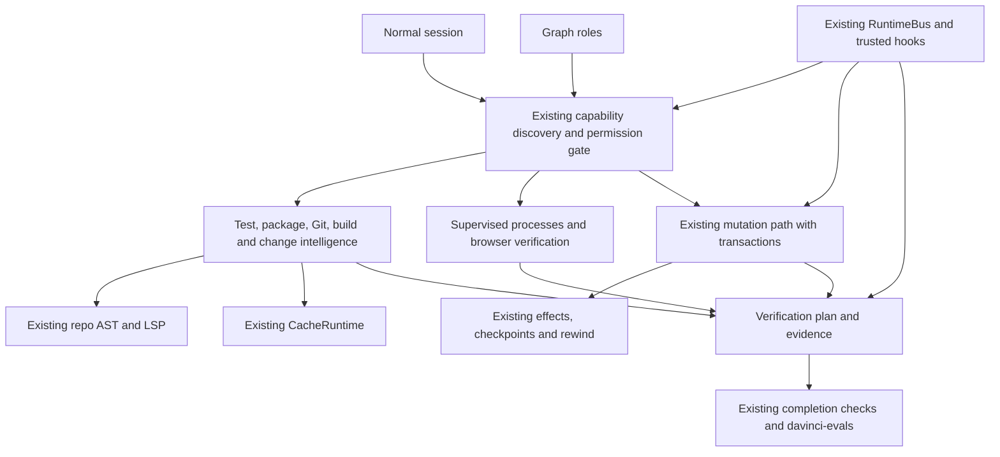

# DaVinci engineering intelligence and verification program

Status: approved by the user on 2026-09-17, including all twelve implementation plans.
Inspected baseline: remote `main`, `ca9fe69cd0da21bf161af25b2bed681748fb0d58`,
fetched 2026-09-17. The supplied [requirements](2026-09-17-engineering-program-requirements.md)
remain the acceptance authority. This document does not reduce their scope.
The [program ledger](../plans/2026-09-17-engineering-program/README.md) links all twelve plans.

## Outcome and delivery boundary

An ordinary authorized DaVinci session must navigate a TypeScript/JavaScript
repository, inspect installed APIs, understand impact, supervise a dev server,
edit with stale-state protection, run appropriate tests/builds, verify a browser
flow, and report source-bound evidence. Graph consumes the same implementations.
Each subsystem is a separate reviewed, tested milestone, with CI green before
the next implementation starts. No single monolithic implementation PR.

The user authorized implementation and feature-branch delivery, requested RTK
and Headroom, prohibited subagents, and limited testing to necessary checks.
Work stays in the existing isolated session worktree. The shared checkout has
pre-existing dirty/untracked work and divergent local main; it is not modified.
The earlier authorization to merge PRs 7 and 8 does not authorize merging new
program PRs. No force pushes.

The design gate in requirements section 34 explicitly says "design approved".
Approval of this document and its twelve linked plans satisfies that gate for
their described scope; material changes to authority or architecture need a new
decision. Planning, evidence gathering and baseline measurement may precede approval.
Production implementation does not precede it. Approval is recorded in the ledger,
never inferred from a file existing or a green test.

## Current architecture and reusable foundations

Paths in this table are repository-relative. These are inspected source facts,
not claims that the proposed subsystems already satisfy acceptance.

| Area | Existing implementation | Reuse and demonstrated gap |
| --- | --- | --- |
| LSP | `crates/davinci-coding-agent/src/native_extensions/language_intelligence/`: LanguageIntelligence, TS/JS server/session/document/transport modules | All eight requested navigation/diagnostic tools exist, lazily started with shared worker transport. Reuse manager and current permission checks; do not add a second LSP client. |
| Repo AST | `native_extensions/repo_intelligence/`: RepoIntelligence, RepoIndex, Tree-sitter adapters, dependency resolver, seven native tools | Reuse parser/index/resolution. `refresh()` currently rescans and rereads source contents on each request, even when parsing is reused. P1 must provide validated incremental reuse for its warm path. Dependency edges currently have module-private visibility; expose a small typed read API rather than parse tool JSON. |
| Cache | `crates/davinci-agent/src/runtime/cache/`: CacheRuntime, CacheKey, CacheDependency, CacheRequest, WorkspaceSnapshot, SingleFlight, persistent CAS | Already landed; Test/Package/Git/Build namespaces exist. Use host-owned instance, exact content/config identities and authorization callbacks. WorkspaceSnapshot here is a cache identity token, not a recoverable filesystem checkpoint. Do not cache mutable live resources as serialized objects. |
| Registration | `extension_host.rs::capabilities/register_with`, `native_extensions/mod.rs`, `runtime/capabilities.rs` | One existing capability registry supports source, class, effects, output/replay/concurrency policy. Register new schemas here. No new registry. |
| Normal dispatch | `main.rs` agent construction and `attach_tool_executor`; `crates/davinci-agent/src/turn.rs` permission gate and tool dispatch | Exercise actual agent assembly, discovery, authorization, dispatch and result handling. A direct module call alone does not prove normal-mode integration. |
| Tool exposure | `ToolExposureState`, `tool_search`, prompt capability router, `main.rs` initial tool projection | Keep full authorized inventory separate from current model schemas. Add deterministic task-relevant selection and negative trigger tests. |
| Graph | `native_extensions/graph/roles.rs`, `worker_hooks.rs`, `process.rs` | Extend allowlists and shared parent resource routing. Worker requests carry parent-issued identity; never trust model-supplied owners. |
| Permissions | `permission.rs`, `permission_risk.rs`, `permission_state.rs`, `shell_policy.rs`, coding-agent `trust.rs` | Reuse current tool modes, path authority, command policy, trust and revocation. New process/browser/hook calls cannot inherit permission from a previous successful call. |
| Background processes | `crates/davinci-agent/src/jobs.rs`: JobBook, Job, ring output, process leases, kill_tree, agent/task provenance; `tools.rs` background bash/stdin tools | Extend existing job ownership and lifecycle with direct argv start, safe reuse, bounded restarts, port metadata and current authorization. Keep existing job tools compatible. |
| Editing | `apply_patch.rs` patch journal and transactional replacements; `tools.rs` write/edit/mutation confinement | Reuse preimages, patch parser and mutation primitives; add explicit transaction identity, hash-checked preview/apply/rollback and normal-tool wrapping. |
| Recovery | `runtime/checkpoints.rs`, `effects.rs`, `rewind.rs`, `worktree.rs`, `source_manifest.rs` | Existing BlobStore/effect/rewind records and Git leases are the basis for transaction recovery and checkpoints, not a second snapshot database. Cache eviction must never remove the only rollback preimage. |
| Browser testing | `interaction_testing/browser.rs`, `artifacts.rs`, `runner.rs` | Typed bridge protocol/origin comparison/fixture receipts exist. Inspected browser module is a fixture state adapter, not proof of a live browser process. Add real maintained backend, bounded state/artifacts and model-facing native adapter. |
| Hooks | `hooks.rs`, `runtime_host.rs::HooksRuntimeSubscriber`, `runtime/bus.rs` and `events.rs` | Project hooks already require trust. Extend events, matching and explicit failure policy. Current runner writes stdin synchronously, collects output without bounds and kills direct child on timeout; use supervised bounded runner for P8. |
| Git | `native_extensions/security_scan/git.rs`; `runtime/worktree.rs` | Existing bounded argv Git inspection and worktree identity patterns. Extract narrowly reusable read-only primitives only as needed; no arbitrary Git command tool. |
| Package management | `packages.rs` | Manages DaVinci extension installation; it is not installed application dependency intelligence. P5 reads metadata without invoking install/lifecycle scripts. |
| Evidence/output | `runtime/evidence.rs`, `evidence_store.rs`, `completion.rs`; `native_extensions/token_governor.rs::OutputStore` | Reuse source-bound verification and exact output retrieval. Plans/recommendations and fixture receipts cannot become real successful command/browser evidence. |
| Settings/UI/provider | `settings.rs`, `davinci-tui/src/davinci/views/settings.rs`, `davinci-ai/src/lib.rs` | Follow serde camelCase settings/merge behavior and existing status/tool-result surfaces. No provider protocol changes needed; no subsystem startup from viewing settings/status. |
| Evaluations | `crates/davinci-evals/src/behavior/`, `harness_eval.rs`, coding-agent repo eval tests | Extend fixtures, trace metrics, scoring and gates. Preserve distinction between deterministic replay, live browser, and live model evaluations. |
| CI | `.github/workflows/ci.yml`, `behavior-evals.yml`, `security-sarif.yml` | CI runs fmt, workspace Clippy, contracts, per-crate shards and native voice platform jobs. Reuse these; add only missing targeted new gates. |

The three prerequisites landed in PRs 6, 7 and 8. Their coexistence does not prove
RepoIntelligence's optional SemanticLanguageProvider is wired to the LSP manager:
current host wiring must be adapted and tested when semantic impact needs it.
Existing repo persistence is not rewritten wholesale merely because CacheRuntime
now exists. Fix only integration gaps required by this program.

## Ownership and data flow

Agent runtime owns generic authorization, execution/effects, process lifetime,
checkpoint and evidence contracts. Coding-agent owns TS/JS analysis, native
adapters, project discovery, browser bridge and settings. Evals owns comparison
fixtures/metrics, not production capability behavior. TUI renders summaries and
artifact references; AI provider code receives the existing normalized tool format.

No separate unified intelligence service, database, registry or event bus is
introduced. "Unified" means typed composition over the existing owners.

## Delivery order and dependency audit

Keep requirement project IDs stable even when execution order differs.

| Sequence | Project | Dependencies | Reason |
| --- | --- | --- | --- |
| 1 | P1 Test Impact | Repo AST, Cache | Establish useful targeted verification immediately. Basic manifest ownership discovery belongs here and is reused later. |
| 2 | P2 Process Manager | JobBook, permissions, runtime events | Supplies supervised argv execution and safe resource reuse. |
| 3 | P4 Transactions | Existing patch/effects/rewind | Required before the browser-edit acceptance loop; follows suggested Phase A. |
| 4 | P3 Browser | P2, existing interaction evidence | Actual UI verification consumes managed local server leases. |
| 5 | P5 Package Intelligence | P1 workspace metadata, Cache | Move before Build: installed versions, workspace edges and lockfile provenance are Build's inputs. Avoid two package parsers. |
| 6 | P7 Build Intelligence | P5 package graph, P1 test scripts | Produce target/command plans without executing them. |
| 7 | P6 Git Intelligence | Repo AST, Cache | Independent of Build but sequential per requested delivery; needed by Impact. |
| 8 | P9 Change Impact | P1, P4, P5, P6, P7, LSP | Compose evidence and explicitly retain incomplete analysis. |
| 9 | P8 Hook/Policy | P2, P4, runtime events | Adds typed process/write/test/completion events to real producers. |
| 10 | P10 Verification Planner | P1, P3, P7, P8, P9 | Cheapest valid sequence with enforced required evidence. |
| 11 | P11 Workspace Snapshot | P4, existing rewind/worktree | Expose safe checkpoints without copying whole repositories. |
| 12 | P12 Continuous Evals | All above | Assemble global acceptance and on/off measurements; fixture baselines start before each earlier project. |

Independent inspection of registration, process/edit primitives, evals and CI was
batched. Production writes remain sequential. No subagents are used.

## Shared contracts and invariants

### Requests and evidence

Resolve workspace, owner, session, Graph node and current permissions from the
host, never from model-provided identity fields. Inputs reject unknown fields,
absolute/outside paths, linked/reparse escape paths and unreasonable lengths.
Analysis outputs contain a summary, stable ordered bounded rows, total/remaining,
truncated/partial flags, evidence source, source identity and reason. A lack of
matches is distinct from missing/unsupported/incomplete analysis.

Typed internal facts retain paths, symbol IDs and ranges, hashes/config revisions,
commands as program/argv/cwd, exit outcomes, Git SHAs and artifact IDs. Optional
failure returns structured unavailable/partial evidence and leaves normal coding
usable. Mutation fails closed when authority, preimage or recovery integrity is
uncertain. No inference is promoted into semantic or verification fact.

### Cache and invalidation

Use CacheRuntime namespaces Test/Package/Git/Build/Query and schema/algorithm
versions. Immutable Git objects use object IDs; package objects include manifests,
lockfiles, installed version and inspected content; mutable graph views include
canonical worktree identity and generation/config dependencies. Calls validate
permission before work and before publishing/returning cached evidence.

P1 must add a bounded, lazy invalidation feed to the existing RepoIntelligence
owner rather than a second scanner/index. Prefer maintained cross-platform file
notifications plus existing successful-mutation notifications. Subscribe before
the initial scan, drain events around snapshot publication, and mark overflow,
root/config/ignore changes or notification failure as requiring full reconciliation.
A fast path is only valid with continuous observation; explicit refresh and
conservative rescans remain available. Metadata timestamps alone cannot prove
content identity. Reopen only changed files after a valid notification sequence.
Cache mapping from a frozen exact index/config identity; do not persist conclusions
that claim a watcher generation is authoritative after process restart.

An event backend unavailable on a platform is a reported conservative fallback,
not proof of meeting warm performance acceptance. Measure fallback separately.

### Resource lifetime and concurrency

Extend JobBook rather than introduce a competing live-process registry. A process
lease binds session/workspace, normalized argv/cwd, trusted environment-policy
digest and authorization scope. Reuse requires equivalent inputs and current
authorization; owner changes and stale leases never attach implicitly. Normal
shutdown drains owned resources. Abrupt-host-exit cleanup uses OS process ownership
where supported and an explicit reconciliation strategy; PID alone is never proof
of ownership. Default restart policy is none; configured retries are bounded.

No native-host or global registry mutex spans process/browser/Git I/O. Reserve
startup under a short lock, spawn outside it, publish/notify, and unwind cancellation
without orphaning. Each live browser context has an operation queue/lock scoped to
that context with timeout/cancellation. Independent workspaces do not share mutable
page, transaction, credential or process state.

### Browser boundary

Use an optional host-installed Playwright backend behind the existing typed
interaction bridge. No runtime auto-install, arbitrary evaluate/CDP tool, inherited
browser profile, raw credentials, package lifecycle or remote debugging attachment.
A managed local server lease supplies the allowed HTTP(S) origin. Explicit trusted
network policy can add origins. Enforce top-level/subresource/popup/redirect and
WebSocket rules in the backend; block service workers to keep traffic observable.
Persist screenshot/trace artifacts under existing bounded evidence storage, return
references, and keep page state/cookies out of disk cache. Viewports and selectors
are validated, and accessibility snapshots do not imply a complete accessibility
audit.

Playwright's maintained APIs were checked for
[network interception](https://playwright.dev/docs/network),
[ARIA snapshots](https://playwright.dev/docs/aria-snapshots), and
[browser context routing/lifecycle](https://playwright.dev/docs/api/class-browsercontext).
The actual installed version and bridge API must be verified during P3; these
documentation references are not evidence of a local executable.

### Mutation and recovery

Wrap existing write/edit/apply_patch/semantic replacement paths. A transaction
records host ownership, workspace/base identity, affected files, preimage and
postimage hashes, sequence, lifecycle and source-bound verification. Preview does
not mutate. Apply acquires the workspace mutation lane, rechecks all preimages
and request authority, durably journals before the first write, and publishes
one effect record per change. Partial failure uses exact owned postimages for
rollback. Changes by another actor stop recovery instead of overwriting them.
Crash recovery never treats an evictable cache as the only durable journal.

External editors cannot be forced to honor an in-process mutex; document and test
the file-system race boundary. Use handle/path-identity revalidation and existing
confined mutation primitives. Do not claim arbitrary OS-wide atomic multi-file
writes. Verified means successful required evidence matches the current resulting
hashes; committed requires observing actual Git state, not setting a boolean.

### Hooks, trust and completion

Extend RuntimeBus and HooksRuntimeSubscriber. Existing config remains compatible.
Rules match typed events/tools/path globs and declare argv, bounded timeout and
warn/block/ignore policy. Config hashes must match host-established project trust;
model-written hook files do not become trusted automatically. Block is meaningful
only at a before-event decision gate; after-events warn or explicitly block a
subsequent completion decision, never claim to undo a completed effect.
Prevent recursive hook loops and bound stdin/stdout/stderr. Reuse P2 execution.

Verification plans describe required checks; only actual source-bound command,
browser and CI receipts satisfy them. Unknown CI scripts are reported, not run
or silently omitted. Auth/crypto/permissions/credentials/process/dependency changes
raise required verification. Targeted tests are the first tier, not blanket
permission to omit package/workspace checks.

## Settings, observability and rollout

Follow existing camelCase top-level subsystem settings with an enabled flag and
only necessary limits/trusted backend configuration. Initial defaults and migration
tests are specified per project. Read-only intelligence can default on with lazy
construction. Execution/edit defaults preserve existing behavior until their
integration gates pass. Disabling a subsystem removes activation and returns
structured unavailable; disabling discovery cannot bypass authorization.

Use one aggregate intelligence status, existing jobs/process status and browser
status only where they communicate useful lifetime/evidence. Cache status remains
the existing command. Track latency, bytes, reads, cache source, partial/failure,
selected/avoided tests, startup/reuse, rollback and verification outcomes through
existing telemetry/evidence. No duplicate global monitoring service.

## Validation and proof

Before each subsystem, capture a fixture baseline using current real public paths.
Write a failing regression/acceptance test, confirm its failure for the intended
reason, implement, run focused checks, then affected crate tests and required
format/lint/integration/security/eval gates. Broader suites run only for shared
contracts and final acceptance. Windows local results and Linux/macOS CI results
are separately recorded; do not infer platform coverage from portable-looking code.

CI currently includes:
- `cargo fmt --check`
- `cargo clippy --workspace --all-targets -- -D warnings`
- affected package `cargo test -p <package>` shards
- prompt/behavior/ecosystem contract checks and Security SARIF schema checks
- native voice Linux/Windows/macOS jobs (existing, not new program acceptance).

Use `--offline --locked` locally when dependencies are present. Newly proposed
test names in subproject plans are acceptance targets, not already-run commands.
Every milestone records exact executed commands, exits, test counts, eval artifact
paths, diff review, commit SHA and matching CI run/job results. A smoke test that
runs zero cases is not evidence. CI success on another SHA is not evidence.

## Global acceptance and report

P12 must run the seventeen-step non-Graph login-button scenario from requirements
section 37 through actual normal-session dispatch with a real local browser, then
prove selective Graph assignment of the same tools. Deterministic fake transport
tests are useful offline gates but cannot replace the real browser path or claim
live model task success. External model runs are a separately authorized lane.

Record all required metrics: task and verification success, incorrect completion
claims, tool calls, full-file reads/bytes, input/output tokens (measured versus
estimated distinguished), cache hits, wall time, tests/count/runtime, process
startups, LSP cold starts, browser success, rollback correctness and CI success.
Also measure startup, memory, first/warm query, activation, process count, browser
startup and cache/index reuse. Compare feature-off/on with identical fixtures and
report medians/distribution and tradeoffs, not invented percentage gains.

The final report includes the resulting architecture, ownership/routing, created
and modified files per project, tools, measured before/after results and regressions,
bug/false-positive/false-negative outcomes, transaction/cleanup/cache reliability,
exact validation/CI, supported/unsupported languages/package managers/browser and
static-analysis limits, and next improvements. The goal remains incomplete until
every requirement has direct evidence. A green planning PR is not implementation.
